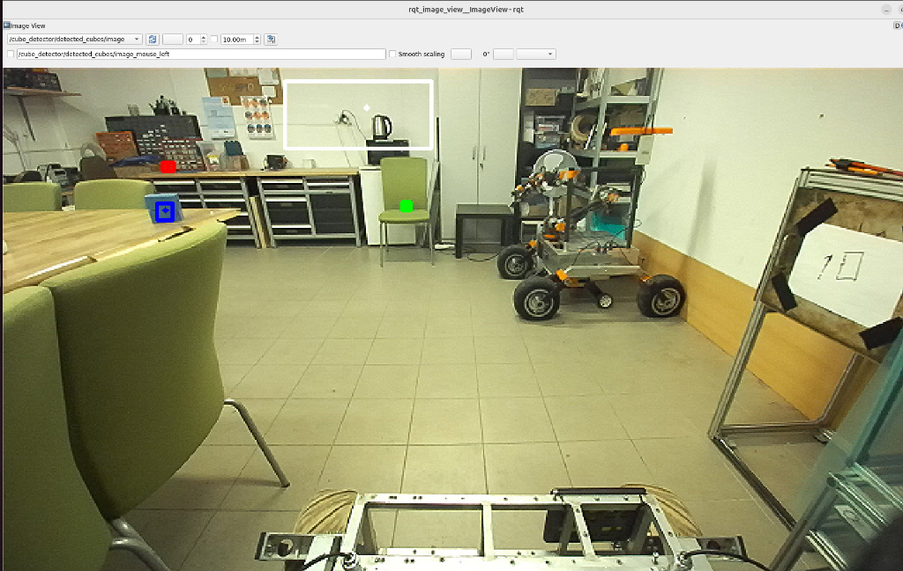

# Projekt Scorpio - zadanie rekrutacyjne do działu Software

> **Uwaga!** Przed przystąpieniem do realizacji zadania przeczytaj **całe** README i pamiętaj, żeby wypełnić [formularz rekrutacyjny](https://forms.gle/byQocAinGP7jo8QM7).

## Spis treści
- [Informacje ogólne](#informacje-ogólne)
- [Zadania do wykonania](#zadania-do-wykonania)
- [Wskazówki i przydatne linki](#wskazówki-i-przydatne-linki)

## Informacje ogólne
Zadanie wymaga instalacji ROS2 Humble i silnie zalecamy korzystania w tym celu z Ubuntu 22.04. Jeżeli nie chcesz instalować na swoim komputerze nowego systemu, to można zrealizować zadanie np. używając [devcontainera](https://code.visualstudio.com/docs/devcontainers/containers).

Wszystkie zadania należy wykonać w języku C++.

Rozwiązane zadanie należy umieścić w **publicznym** repozytorium (np. GitHub), które jest forkiem tego repozytorium, i przesłać link do tego forka na mail projekt@scorpio.pwr.edu.pl. Ewentualne pytania lub wątpliwości co do treści zadania można kierować na tego samego maila. Zadania przyjmujemy do 29.03.2026 do końca dnia.

## Zadania do wykonania 
Pamiętaj, że zadanie służy sprawdzeniu wielu umiejętności - nie tylko programowania i znajomości algorytmów -  więc nawet w przypadku zrealizowania tylko części z poniższych punktów, zachęcamy do przesłania rozwiązania. Postępy w zadaniu powinny być udokumentowane w repozytorium na GitHubie.

1. **Konfiguracja ROS'a i zbudowanie przykładu**

  - Należy zainstalować ROS2 Humble zgodnie z [oficjalną instrukcją](https://docs.ros.org/en/humble/Installation.html) na odpowiedni system.
  - Należy [utworzyć workspace ROS-owy](https://docs.ros.org/en/humble/Tutorials/Beginner-Client-Libraries/Creating-A-Workspace/Creating-A-Workspace.html), stworzyć fork tego repozytorium, i sklonować ten fork do folderu `src` w workspace.
  - To repozytorium jest paczką ROS2 zawierającą przykładowego node'a, który demonstruje podstawowe funkcjonalności ROS2.
  - Należy zbudować workspace, zsourceować go, i uruchomić przykładowego node'a za pomocą `ros2 run scorpio_zadanie_rekrutacyjne_software echo` (więcej informacji o każdym z tych kroków znajdziecie w [tym tutorialu](https://docs.ros.org/en/humble/Tutorials/Beginner-Client-Libraries/Creating-A-Workspace/Creating-A-Workspace.html)) 
  - Node udostępnia dwa topici:
    - `/cube_detector/input` - topic typu `std_msgs/msg/String`, na który można wysyłać wiadomości tekstowe, które będą logowane, oraz wysyłane na `/cube_detector/output`.
    - `/cube_detector/output` - topic typu `std_msgs/msg/String`, na który node wysyła wiadomości tekstowe, które otrzymał na poprzednim topicu.
  - Należy przetestować działanie node'a komendami `ros2 topic pub` oraz `ros2 topic echo`.

  > **Wskazówka!** Możesz użyć tego przykładowego node'a jako bazy do realizacji kolejnych punktów zadania, ale nie jest to konieczne. Jeżeli wolisz, możesz stworzyć własny node lub node'y od zera, które będą realizować poniższe funkcjonalności.
  
2. **Wykrywanie ilmenitu**

  > **Uwaga** To zadanie nie musi zostać wykonane jako node ROS'owy!

  W folderze `assets/ilmenite_samples` znajdują się zdjęcia mikroskopowe piasku, który zawiera domieszkę [ilmenitu](https://en.wikipedia.org/wiki/Ilmenite) (ciemniejsze ziarna na zdjęciu). Celem zadania jest napisanie oprogramowania implementującego metodę określania zawartości procentowej ilmenitu w całej próbce widocznej na jednym zdjęciu. W ramach pojedyńczego wywołania programu należy przeanalizować każdą próbkę zawartą w folderze. Dla każdej próbki wynik powinień być wypisany na konsolę w następujący sposób:
  ```
  sample_A.jpg - 15.0%
  sample_B.jpg - 98.0%
  [...]
  ```
  
3. **Wykrywanie kolorowych kostek na obrazie z kamery**

  Twoim zadaniem będzie wykrycie kolorowych kostek na obrazie z kamery i określenie współrzędnych ich środka na każdej klatce.

  Do tego zadania nagraliśmy obraz z kamery umieszczonej na łaziku przejeżdżającym przez nasz warsztat. W warsztacie rozmieściliśmy 4 kolorowe kostki:
  <div style="display: flex; justify-content: center; gap: 10px;">
    
  </div>

  Nagranie z kamery jest w formie [rosbag'a](https://github.com/ros2/rosbag2) - należy go pobrać: [camera_bag](https://drive.google.com/drive/folders/1RNJ_MQEDyT7ztbrAlsZgNJ8jTBF5X6Yu?usp=sharing). Zostały nagrane dwa topici:
  - `/zed/zed_node/left_raw/image_raw_color` typu `sensor_msgs/msg/Image`: obraz z kamery nagrany w naszym warsztacie.
  - `/zed/zed_node/left_raw/camera_info` typu `sensor_msgs/msg/CameraInfo`: parametry kamery.

  Należy odtworzyć rosbaga za pomocą komendy `ros2 bag play <ścieżka do pobranego folderu>`.

  > **Wskazówka!** Argument `--loop` pozwala na odtwarzanie rosbaga w pętli, co może być przydatne podczas testowania rozwiązania. 
  
  Dla każdej klatki obrazu odtworzonego z rosbaga należy opublikować na czterech topicach typu `geometry_msgs/msg/Point` wiadomość określającą współrzędne `x` i `y` środka danej kostki na klatce w pikselach (pole `z` należy zostawić puste). Jeżeli dana kostka nie jest widoczna na klatce, to w pola x i y wstawić minimalną wartość `Float64`. Nazwy topiców powinny być następujące:
  - `cube_detector/red_cube/position_on_frame`: topic dla czerwonej kostki
  - `cube_detector/green_cube/position_on_frame`: topic dla zielonej kostki
  - `cube_detector/blue_cube/position_on_frame`: topic dla niebieskiej kostki
  - `cube_detector/white_cube/position_on_frame`: topic dla białej kostki

> **Wskazówka!** ROS2 udostępnia bibliotekę [cv_bridge](https://index.ros.org/p/cv_bridge/), pozwalającą m. in. przetwarzać obraz z topiców na `cv::Mat` z biblioteki OpenCV. Aby skorzystać z dodatkowych paczek w ramach tego projektu należy zmodyfikować `CMakeLists.txt` i `package.xml` - przykład dla tej biblioteki znajdziecie zakomentowany w tych plikach. Po zdefiniowaniu zależności polecenie `rosdep install --from-paths src -y --ignore-src` wywołane z poziomu workspace zainstaluje odpowiednie paczki.

4. **Rysowanie bounding box**

  Twoim zadaniem jest narysować [bounding boxy](https://docs.opencv.org/4.x/da/d0c/tutorial_bounding_rects_circles.html) wokół każdej z kostek, które będą widoczne na obrazie i tak zmodyfikowany obraz opublikować.

  Należy wykorzystać tego samego rosbag'a, co w poprzednim zadaniu.

  Należy, dla każdej klatki z rosbag'a, opublikować obraz z narysowanymi bounding boxami na topicu `cube_detector/detected_cubes/image` typu `sensor_msgs/msg/Image`. Obraz powinien być taki sam jak ten z topicu `/zed/zed_node/left_raw/image_raw_color`, ale z narysowanymi bounding boxami wokół widocznych kostek.

  > **Wskazówka!** Do podglądu obrazu na topicu można użyć np. [rqt](https://docs.ros.org/en/humble/Concepts/Intermediate/About-RQt.html).

## Wskazówki i przydatne linki

- Zadanie rekrutacyjne można oddać niepełne.
- Rozwiązane zadanie należy umieścić w **publicznym** repozytorium (np. GitHub) i przesłać linka do tego repozytorium na mail projekt@scorpio.pwr.edu.pl. Ewentualne pytania lub wątpliwości co do treści zadania można kierować na tego samego maila. Zadania przyjmujemy do 29.03.2026 do końca dnia.
- [ROS2 Humble crash course](https://www.youtube.com/watch?v=Gg25GfA456o)
- [Oficjalna dokumentacja ROS2 Humble](https://docs.ros.org/en/humble/index.html)
- [Oficjalna dokumentacja RCLCPP](https://docs.ros.org/en/humble/p/rclcpp/)

**Jeżeli będziesz miał jakiekolwiek wątpliwości i problemy z zadaniem śmiało skontaktuj się z nami na maila projekt@scorpio.pwr.edu.pl! Powodzenia :)**

# Rozwiązanie

## Zadanie 2
Stworzyłem plik w `src/ilmenite_ratio.cpp`, który można odpalić jako node ros-owy.

Zadanie zostało rozwiązane na podstawie binaryzacji obrazu. Ze względu na to, że kawałki ilmentu były znacznie ciemniejsze, to zdecydowałem się na załadowanie zdjęcia w skali szarości, lekki rozmycie w celu usunięcia szumu i ustalenie sztywnego progu.

Aby odpalić plik należy zbudować rozwiązanie
```
colcon build
```
Następnie zsourceować setup
```
source install/setup.bash
```
Następnie odpalić węzeł
```
ros2 run scorpio_zadanie_rekrutacyjne_software ilmenite_ratio
```

## Zadanie 3 i 4
Zadania zostały rozwiązane razem w pliku `cube_detector_node.cpp`.

Kropki z zadania 3 oprócz bycia opublikowanym na topici będą też widoczne na publikowanym obrazie kamery. Zadanie zostało wykonane na podstawie analizy obrazu w przestrzeni barw HSV z prostymi i sztywno ustawionymi progami kolorów i wielkości kostki.

Aby przetestować rozwiązanie należy je zbudować
```
colcon build
```
Zsourceować setup
```
source install/setup.bash
```
Odtworzyć rosbaga (najlepiej w pętli)
```
ros2 bag play <sciezka do folderu z rosbagiem> --loop
```
Odpalić node z rozwiązaniem
```
ros2 run scorpio_zadanie_rekrutacyjne_software cube_detector_node
```
Otworzyć rqt image view w celu podglądnięcia obrazu z topicu
```
ros2 run rqt_image_view rqt_image_view
```


Jeśli chodzi o to zadanie to działa... średniawo.
Aktualny algorytm bazuje jedynie na szukaniu odpowiednich kolorów w przestrzeni HSV.
Niestety nie miałem już czasu na dokończeniu drugiego podejścia, ale przedstawię pomysł.
1. Nałożenie filtru bilateralnego
2. Zamienienie obrazu na przestrzeń HSV
3. Wyciągnięcie z obrazu regionów względem odpowiednich kolorów
4. Poszerzenie znalezionych obszarów z użyciem dylatacji
5. Zamiana na skale szarości
6. Na tych regionach uruchomienie detektra Canny aby znaleźć krawędzie
7. Zamknięcie morfologiczne na krawędziach
8. Iteracja po krawędziach i filtrowanie ich względem tego jak bardzo kwadratowe są. Area > 20 -> convex hull -> aspect ratio < 1.25
9. Wyłonienie największego
10. Nałożenie bounding boxów i środków
